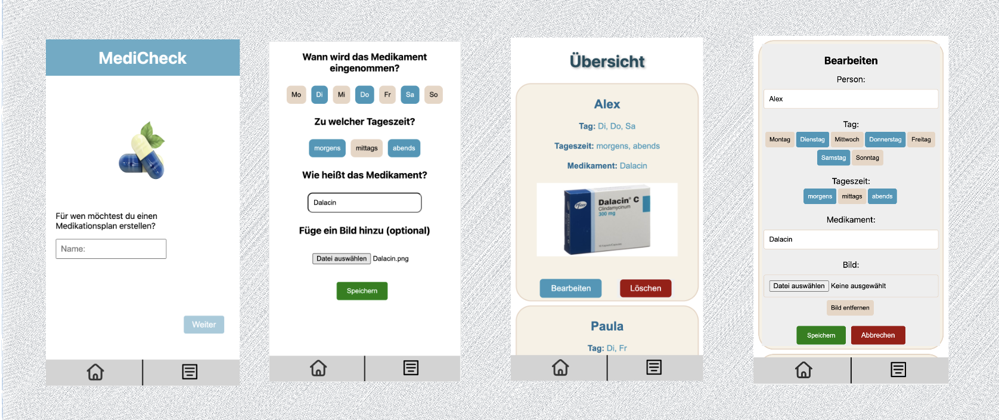

# MediCheck 

I have developed a Medication Planner App using React and Next.js. This app is designed to help users manage their medication schedule easily and effectively. It provides features such as:

- User can create multiple entries for different individuals to create medication plans for.
- Ability to upload images for medication records, if desired.
- Entries can be edited and deleted at any time.

---

Before we dive into the details, here's a sketch of the MediCheck app's user interface:

I hope this gives you a visual idea of the app's layout and design. Now let's explore its features and functionality!

Feel free to test my app on Vercel by clicking [here](https://medi-check-nine.vercel.app/). I would love to hear your feedback and suggestions for further improvements.

--

### I have utilized the following technologies: 
- React
- Next.js
- Styled Components
- Git
- npm
- Jest
- React Testing Library
- Cloudinary

